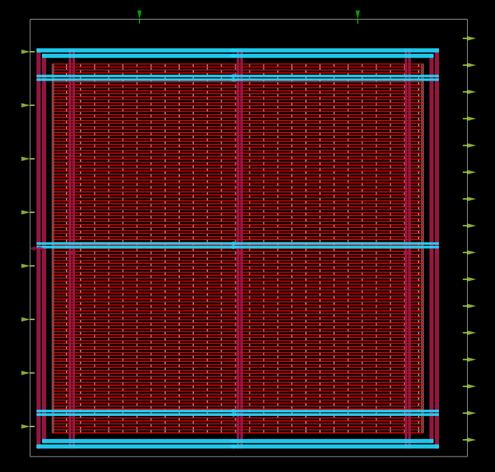
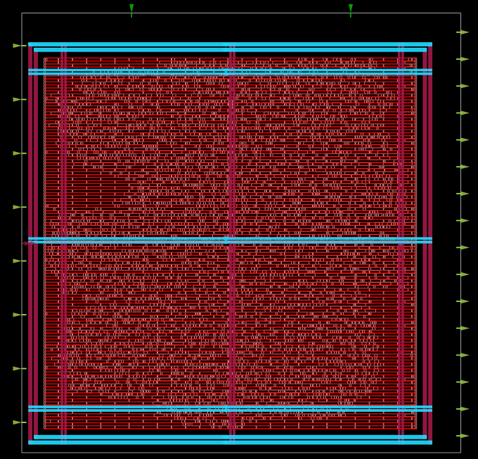
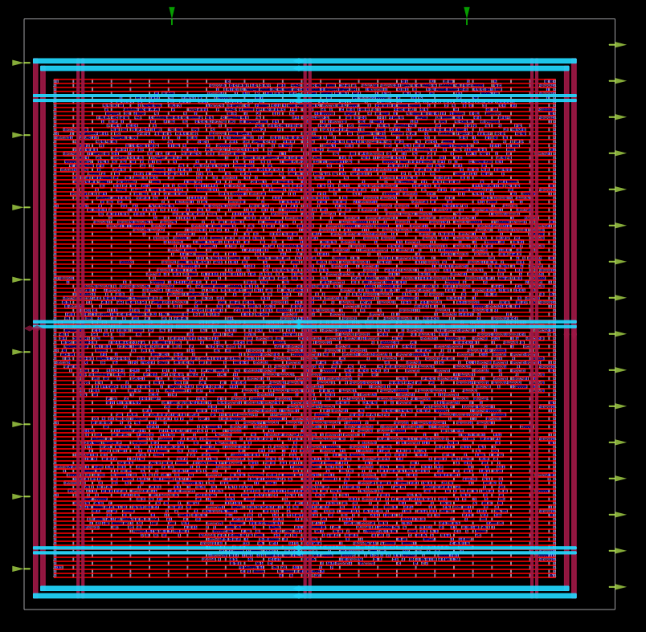
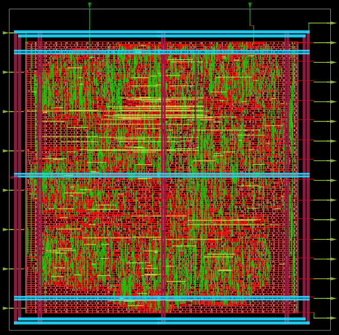
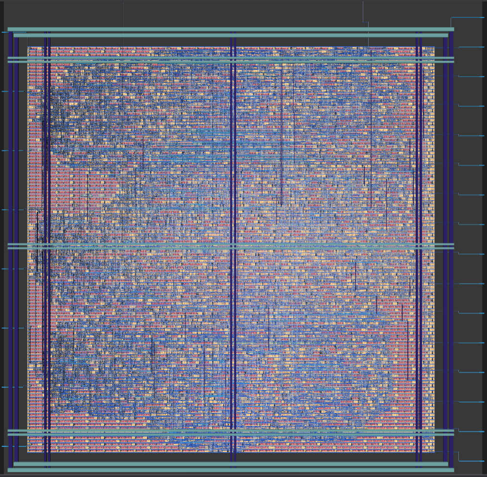

# CSA-Based Distributed Arithmetic FIR Filter: RTL-to-GDS Implementation using OpenLane and SKY130

A complete RTL-to-GDS implementation of a **pipelined Carry Save Adder (CSA) based Distributed Arithmetic (DA) FIR Filter** using the OpenLane ASIC flow and the SKY130 Open PDK. This project demonstrates the complete ASIC implementation flow, starting from synthesizable Verilog RTL and ending with the generation of the final GDSII layout.

---

## Overview

Finite Impulse Response (FIR) filters are widely used in digital signal processing for applications such as image processing, wireless communication, biomedical instrumentation, radar systems, and audio processing. Conventional FIR filters require multiple hardware multipliers, which significantly increase silicon area, power consumption, and critical path delay.

This project implements a **16-Tap multiplier-less FIR filter** using **Distributed Arithmetic (DA)** and **Carry Save Adders (CSA)**. Distributed Arithmetic replaces conventional multipliers with bit-level partial sum computations, while a multi-stage Carry Save Adder architecture accelerates accumulation by delaying carry propagation until the final stage. To further improve timing performance, pipeline registers are inserted after every major computation stage, reducing the critical path and enabling higher operating frequencies.

The complete design has been synthesized, placed, routed, and physically verified using the **OpenLane RTL-to-GDS flow** targeting the **SKY130 HD Standard Cell Library**.

---

## Key Features

- 16-Tap FIR Filter
- Multiplier-less architecture using Distributed Arithmetic (DA)
- Multi-stage Carry Save Adder (CSA) accumulation
- Deep pipelined architecture for improved timing performance
- Fully synthesizable Verilog RTL
- Functional verification using Verilog testbench
- Complete RTL-to-GDS implementation using OpenLane
- Physical verification including DRC, LVS, timing analysis, and antenna checks

---

## Hardware Optimizations

| Optimization | Description |
|--------------|-------------|
| Distributed Arithmetic | Eliminates hardware multipliers using bit-level coefficient accumulation |
| Carry Save Adder | Accelerates multi-operand addition by postponing carry propagation |
| Pipelining | Registers inserted between computation stages to reduce critical path delay and improve timing |

---

## Design Flow

```text
RTL Design
     │
     ▼
Functional Verification
     │
     ▼
Logic Synthesis
     │
     ▼
Floorplanning
     │
     ▼
Placement
     │
     ▼
Clock Tree Synthesis
     │
     ▼
Global & Detailed Routing
     │
     ▼
Static Timing Analysis
     │
     ▼
DRC / LVS Verification
     │
     ▼
GDSII Generation
```

---

## Repository Structure

```text
csa_da_fir_rtl_to_gds/
│
├── csa_da_fir/
│   ├── src/                  RTL source files
│   ├── csa_tb.v              Testbench
│   ├── csa_da_openlane.vcd   Simulation waveform
│   ├── config.tcl            OpenLane configuration
│   ├── pin_order.cfg         Pin assignment
│   ├── schematic.pdf         RTL schematic
│   └── README.md
│
├── images/
│   ├── floorplan.png
│   ├── placement.png
│   ├── cts.png
│   ├── routing.png
│   └── gdsII.png
│
├── runs/
│   ├── reports/
│   ├── results/
│   └── README.md
│
├── LICENSE
└── README.md
```

---

## Tools Used

| Tool | Purpose |
|------|---------|
| Verilog HDL | RTL Design |
| OpenLane | RTL-to-GDS ASIC Flow |
| OpenROAD | Physical Design |
| Yosys | Logic Synthesis |
| OpenSTA | Static Timing Analysis |
| Magic | Layout Generation & DRC |
| Netgen | LVS Verification |
| GTKWave | Functional Simulation |

---

## Technology

- SKY130 HD Standard Cell Library
- OpenLane
- OpenROAD

---

## Physical Design Flow

### Floorplanning

<p align="center">

</p>

The floorplanning stage defines the die dimensions, core utilization, power distribution network, and I/O pin placement before physical implementation.

---

### Placement

<p align="center">

</p>

Standard cells are legally placed while optimizing wirelength and minimizing routing congestion.

---

### Clock Tree Synthesis (CTS)

<p align="center">

</p>

Clock Tree Synthesis inserts clock buffers to distribute the clock with minimal skew and balanced latency across sequential elements.

---

### Routing

<p align="center">

</p>

Global and detailed routing establish all signal connections while satisfying design-rule constraints and preparing the design for signoff verification.

---

### Final GDSII Layout

<p align="center">

</p>

Final layout generated after successful routing, timing closure, DRC, LVS, and antenna verification.

---

## Implementation Summary

| Parameter | Value |
|-----------|--------|
| Design | CSA-Based Distributed Arithmetic FIR Filter |
| Filter Type | 16-Tap FIR |
| RTL Language | Verilog HDL |
| Arithmetic Technique | Distributed Arithmetic |
| Adder Architecture | Carry Save Adder |
| Pipeline Architecture | Multi-stage Pipelined |
| Technology | SKY130 HD Standard Cell Library |
| ASIC Flow | OpenLane RTL-to-GDS |
| Functional Verification | Verilog Testbench |
| Physical Verification | DRC, LVS, STA |
| Generated Outputs | DEF, LEF, GDSII, LIB, SDF, SPEF, SPICE, Gate-Level Netlist |

---

## Physical Verification

The generated layout successfully completed the physical verification stage.

| Verification | Status |
|--------------|:------:|
| Logic Synthesis | ✔ Passed |
| Floorplanning | ✔ Completed |
| Placement | ✔ Completed |
| Clock Tree Synthesis | ✔ Completed |
| Routing | ✔ Completed |
| Static Timing Analysis | ✔ Passed |
| DRC | ✔ Passed |
| LVS | ✔ Passed |
| Antenna Check | ✔ Passed |
| GDSII Generation | ✔ Completed |

---

## Generated Outputs

The OpenLane flow generates the following implementation artifacts.

- GDSII Layout
- DEF
- LEF
- Liberty Timing Library (.lib)
- Gate-Level Verilog Netlist
- SDF
- SPEF
- SPICE Netlist
- Magic Layout
- OpenDB Database

---

## Applications

- Digital Signal Processing
- Image Processing
- Audio Processing
- Biomedical Signal Analysis
- Wireless Communication
- FPGA and ASIC Accelerators
- Embedded DSP Systems

---

## Conclusion

This project demonstrates the complete RTL-to-GDS implementation of a **pipelined Carry Save Adder based Distributed Arithmetic FIR Filter** using the OpenLane ASIC flow and SKY130 technology. By replacing conventional multipliers with Distributed Arithmetic, accelerating accumulation through a Carry Save Adder architecture, and introducing pipelining across major computation stages, the design achieves a hardware-efficient implementation with improved timing performance. The successful completion of synthesis, placement, routing, timing verification, DRC, LVS, and GDSII generation validates the proposed architecture for efficient ASIC-based digital signal processing applications.

---

## License

This project is licensed under the **MIT License**.
